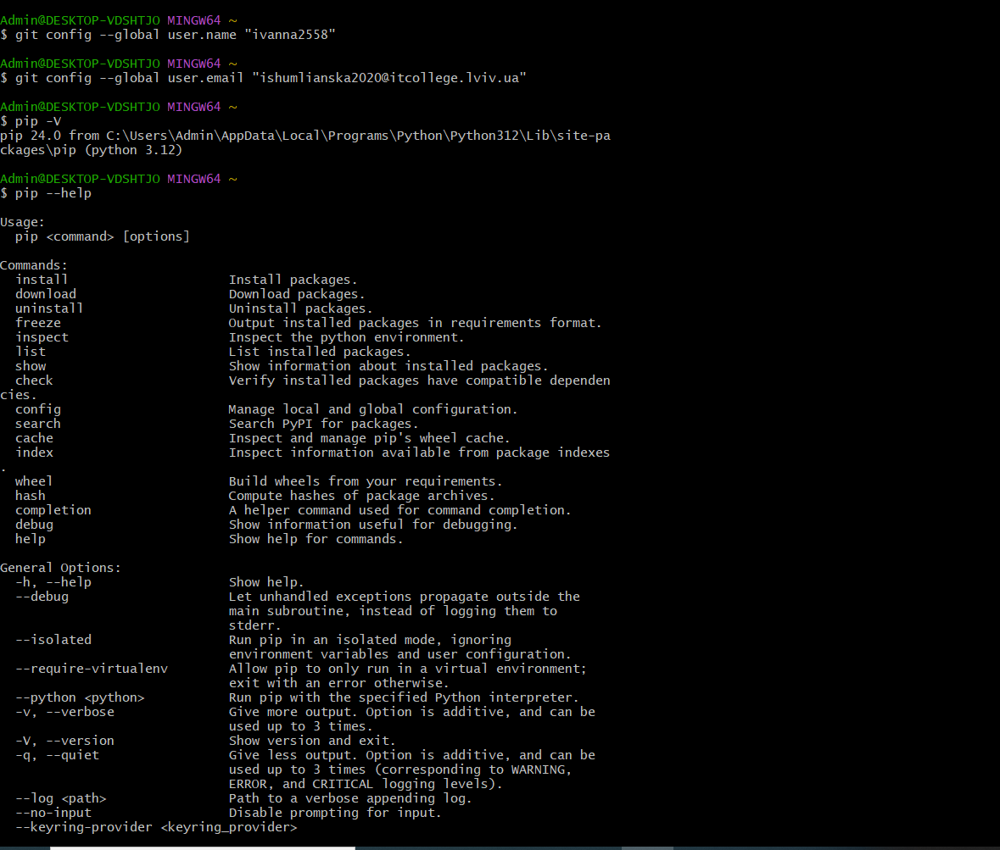
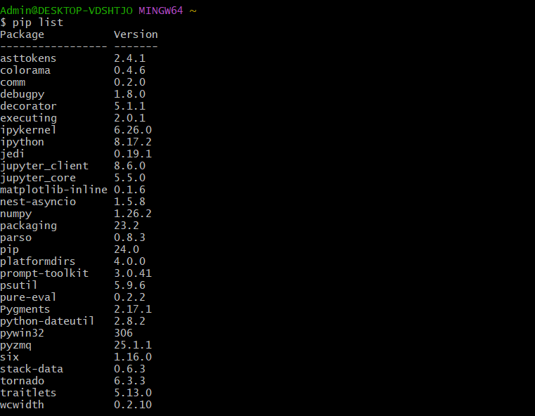
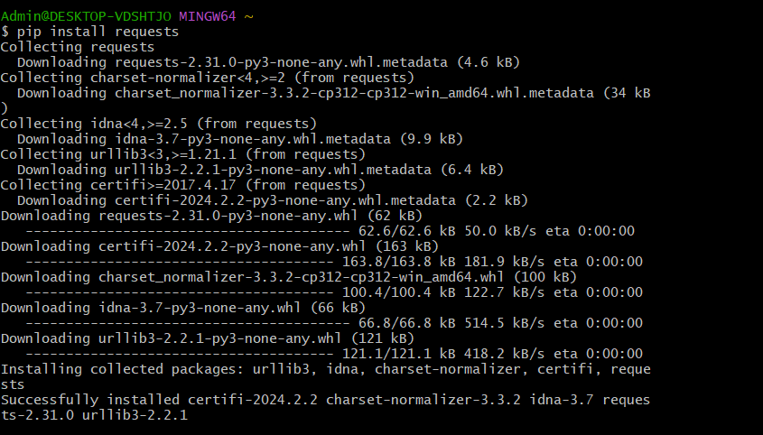
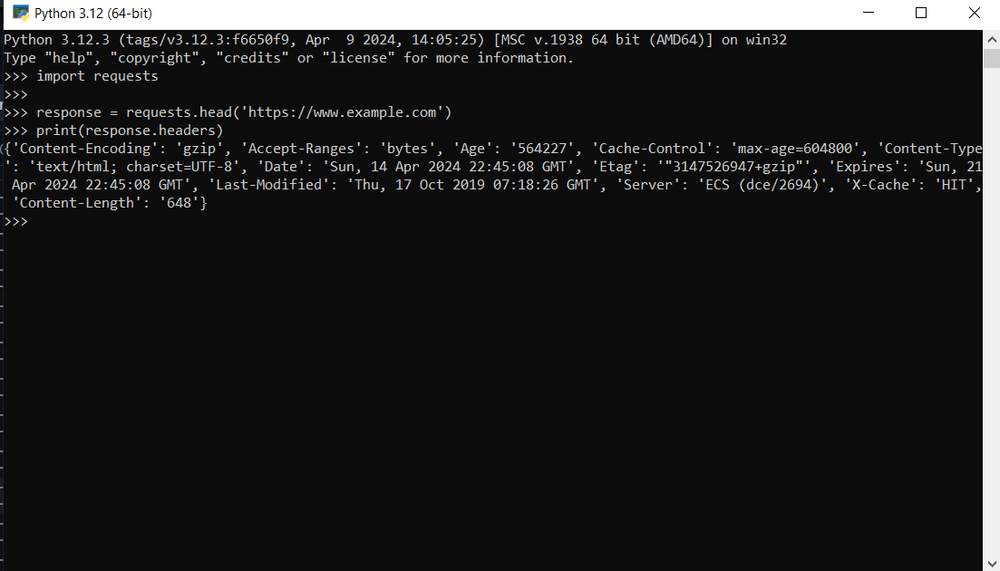
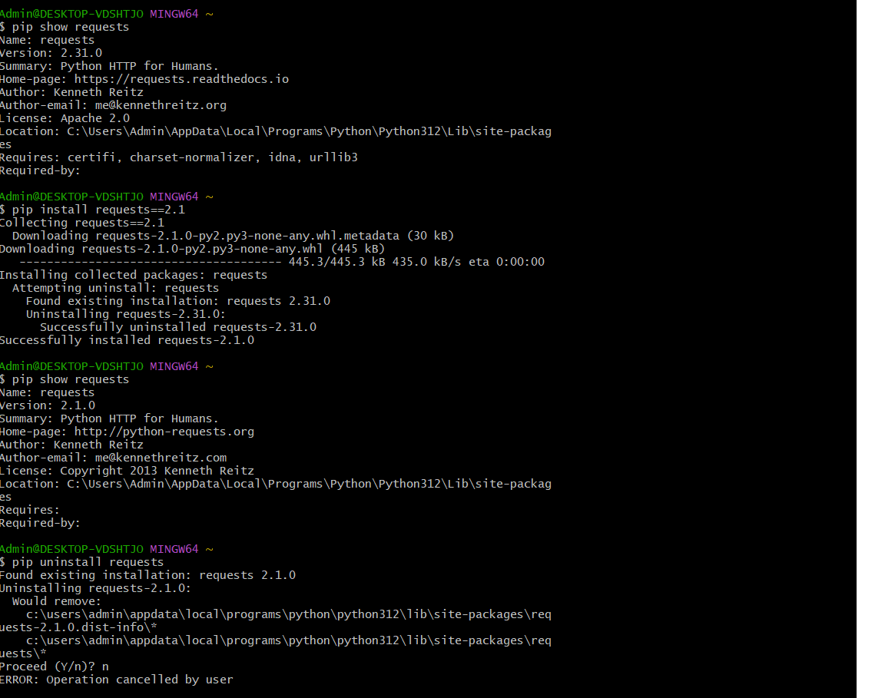

# Звіт до роботи
## Тема: _Робота з віртуальними середовищами_
### Мета роботи: _Навчитись створювати та працювати у віртуальних середовищах та переключатись між проектами_

---
### Виконання роботи
- Результати виконання завдання ;
## Основи роботи з сторонніми бібліотеками
1. Для роботи з сторонніми бібліотеками їх потрібно спочатку встановити. Для їх встановлення є інструмент PIP (Python Install Package). Перевірила чи він встановлений на компютері:  
2. Передивилась які дії можна зробити за допомогою pip. Перевірила які бібліотеки вже інстальовані на компютері: 

3. Встановила бібліотеку requests: 

4. Ознайомилась із методами які є в бібліотеці requests, та їх використала: 

Виконала HTTP HEAD-запит до веб-сайту https://www.example.com за допомогою бібліотеки requests. Потім вивела заголовки відповіді, які містять різні інформаційні поля, такі як тип вмісту, кодування, дата, сервер і т. д.
5. Результат виконання команд 

```python
pip show requests
pip install requests==2.1
pip show requests
pip uninstall requests 
```

:

- pip show requests - ця команда виводить інформацію про встановлену версію пакету requests.
- pip install requests==2.1 - ця команда встановлює конкретну версію пакету requests, яка дорівнює 2.1.0. 
- pip show requests - після встановлення нової версії пакету requests, ця команда знову виводить інформацію про пакет, підтверджуючи, що нова версія успішно встановлена. 
- pip uninstall requests - ця команда починає процес видалення пакету requests. Я скасувала цю операцію.
## Робота у віртуальному середовищі
1. Для створення VENV та його активації виконала команди:

```python
python -m venv ./my_env
source my_env/Scripts/activate
pip install requests
deactivate
pip show requests
```
> Остання команда вивела інформацію про встановлений пакет requests, включаючи версію, автора, ліцензію, та інші деталі, такі як розташування і залежності.

# Робота з Pipenv

Для інсталяції застосувала команду:
> pip install pipenv
># Після успішного виконання команди виконайте
>pipenv --help

За допомогою pipenv можна виконувати наступні команди:
1. pipenv install: Ця команда встановлює всі залежності, вказані у файлі Pipfile, у віртуальному середовищі pipenv.
2. pipenv shell: Команда відкриває новий shell з активованим віртуальним середовищем pipenv. Це дозволяє виконувати команди в середовищі, де встановлені залежності проекту.
3. pipenv run <команда>: Ця команда виконує вказану команду в контексті віртуального середовища pipenv, тобто вона виконується з урахуванням залежностей, встановлених для проекту.
4. pipenv lock: Генерує файл Pipfile.lock, який фіксує конкретні версії всіх пакетів, що встановлені в середовищі pipenv. Це забезпечує відтворюваність середовища на інших системах.
5. pipenv install <пакет>: Ця команда дозволяє встановлювати нові пакети в віртуальне середовище pipenv.
6. pipenv uninstall <пакет>: Видаляє вказаний пакет з віртуального середовища pipenv.
7. pipenv check: Перевіряє наявність проблем у файлі Pipfile та Pipfile.lock, такі як відсутність пакетів або несумісність версій.
8. pipenv graph: Виводить граф залежностей у вигляді списку, де кожен пакет та його залежності перераховані зі зв'язками між ними.
9. pipenv --rm: Видаляє віртуальне середовище pipenv, разом з усіма встановленими залежностями, пов'язаними з ним.

Для створення нового середовища та інсталяції бібліотек виконала наступні команди:
pipenv --python 3.10
pipenv --venv
pipenv run python -V
pipenv install requests

У файлах Pipfile та Pipfile.lock знаходиться:
Pipfile містить інформацію про залежності проекту, такі як пакети та їх версії, а також іншу конфігураційну інформацію.
Pipfile.lock фіксує конкретні версії всіх пакетів, що встановлені в середовищі pipenv. Він забезпечує відтворюваність середовища на інших системах.

# Робота зі змінними середовища
> Що буде якщо виконати скрипт без активації віртуального середовища?
> Якщо виконувати скрипт без активації віртуального середовища, програма буде виконуватися в глобальному середовищі Python, якщо, звісно, є всі необхідні залежності встановлені глобально.
Якщо потрібні залежності не встановлені глобально або є конфлікти версій залежностей, програма може викинути помилку, оскільки не буде мати доступу до потрібних бібліотек.
