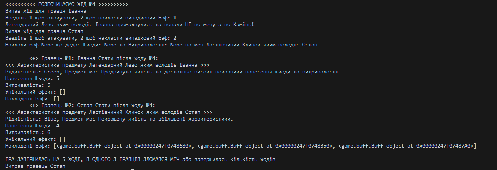

# Звіт до роботи

## Тема: Робота з класами та написання програми для тестування

## Мета роботи: Опрацювати основні поняття ООП, навчитись створювати та працювати з класами та написати програму яку будемо використовувати для тестування

### Виконання роботи

Результати виконання завдань:
Ми будемо працювати у Пайтон Ноутбуках та пробуємо базові конструкції ООП;
Попрацювали з ООП та кодом Пайтон у файлі nb.ipynb;
Розробили два класи, Меча та Бафів до нього, вони представлені у відповідних файлах та виокремлені у модуль поміщений у папку game;
Створили основну програму для гри, де два гравці можуть замагатись на Мечах, код програми записаний у game.py;
Програма вивела наступні результат представлені на скріншоті 
Добавили з gitignore __pycache__/.
Навчились опрацьовувати основні поняття ООП, навчились створювати та працювати з класами та написали програму яку будемо використовувати для тестування