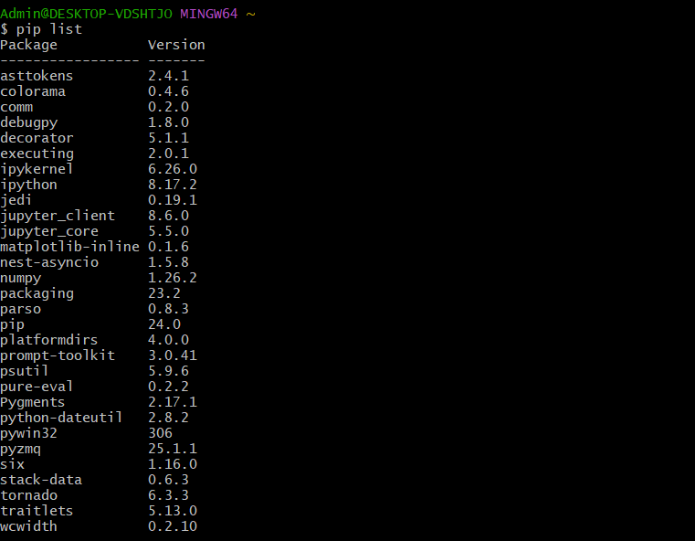
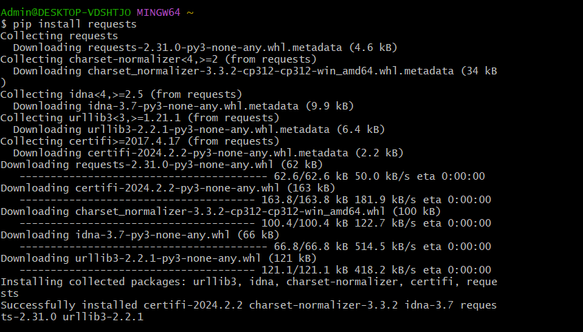
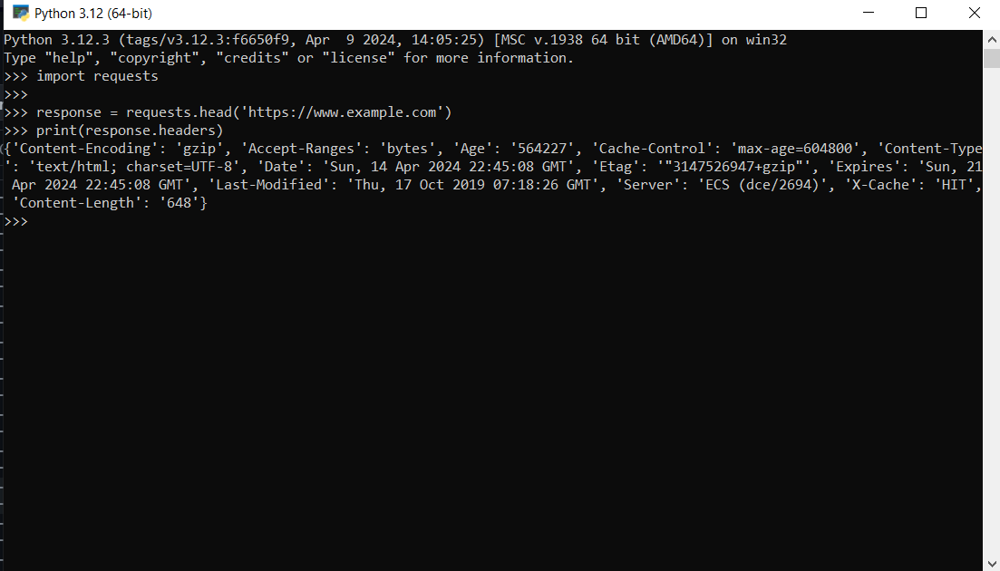

# Звіт до роботи
## Тема: _Робота з віртуальними середовищами_
### Мета роботи: _Навчитись створювати та працювати у віртуальних середовищах та переключатись між проектами_

---
### Виконання роботи
- Результати виконання завдання ;
1. Для роботи з сторонніми бібліотеками їх потрібно спочатку встановити. Для їх встановлення є інструмент PIP (Python Install Package). Перевірила чи він встановлений на компютері:  
2. Передивилась які дії можна зробити за допомогою pip. Перевірила які бібліотеки вже інстальовані на компютері: 

3. Встановила бібліотеку requests: 

4. Ознайомилась із методами які є в бібліотеці requests, та їх використала: 

Виконала HTTP HEAD-запит до веб-сайту https://www.example.com за допомогою бібліотеки requests. Потім вивела заголовки відповіді, які містять різні інформаційні поля, такі як тип вмісту, кодування, дата, сервер і т. д.
5. Результат виконання команд 

```python
pip show requests
pip install requests==2.1
pip show requests
pip uninstall requests 
```

:

- pip show requests - ця команда виводить інформацію про встановлену версію пакету requests.
- pip install requests==2.1 - ця команда встановлює конкретну версію пакету requests, яка дорівнює 2.1.0. 
- pip show requests - після встановлення нової версії пакету requests, ця команда знову виводить інформацію про пакет, підтверджуючи, що нова версія успішно встановлена. 
- pip uninstall requests - ця команда починає процес видалення пакету requests. Я скасувала цю операцію.
6. 